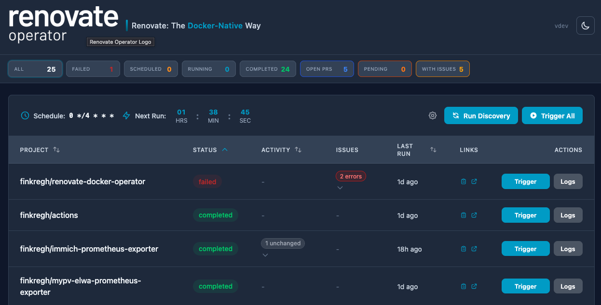
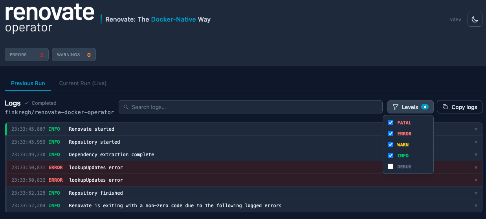

# renovate-docker-operator

A standalone Docker-based operator for running [Renovate](https://github.com/renovatebot/renovate) against Forgejo/Gitea instances. Manages Renovate containers via Docker socket — no Kubernetes required.





## Origin & Motivation

This project is a fork of [**mogenius/renovate-operator**](https://github.com/mogenius/renovate-operator), adapted for environments that don't run Kubernetes.

**Why does this exist?**

1. **Renovate CE/EE does not support Forgejo.** The feature request ([mend-io/renovate-ce-ee#173](https://github.com/mend-io/renovate-ce-ee/issues/173)) was locked and closed without resolution. If you self-host Forgejo, Mend's commercial offering simply won't work.

2. **The upstream renovate-operator is Kubernetes-only.** It relies on CRDs, controller-runtime, and Kubernetes Jobs for container orchestration — a non-starter if your infrastructure is Docker Compose, Podman, or a single VM.

3. **This project extracts the core logic into a standalone binary** that talks directly to the Docker socket. Same features (priority queues, parallelism, webhooks, discovery, UI), zero Kubernetes dependencies, single ~20 MB binary + SQLite for state.

> **Credit:** The Forgejo webhook handling, repository discovery agent, priority queue, and web UI patterns all originate from the excellent work by the [mogenius](https://github.com/mogenius) team. Thank you for building this in the open.

## Features

- **Docker-native**: No Kubernetes required. Manages Renovate containers via Docker socket.
- **SQLite state**: Lightweight persistence with WAL mode for concurrent access.
- **Webhook-driven**: Forgejo webhooks trigger immediate Renovate runs on PR/issue changes.
- **Cron scheduling**: Automatic discovery and execution on configurable cron schedules.
- **Web UI**: Dashboard showing job status, project runs, and streaming logs.
- **OIDC auth** (planned): Optional authentication via any OIDC provider.
- **`RENOVATE_*`w pass-through**: All `RENOVATE_*` env vars on the operator are injected into spawned containers.
- **Image caching**: Configurable TTL avoids redundant Docker image pulls.
- **Access logging**: HTTP access log middleware with webhook auth enrichment.
- **CSRF protection**: Origin-based CSRF middleware on state-changing requests.

## Quick Start

```bash
# 1. Clone
git clone https://git.h.oluflorenzen.de/finkregh/renovate-docker-operator.git
cd renovate-docker-operator

# 2. Copy and edit environment file
cp .env.example .env
# Edit .env — set RENOVATE_TOKEN at minimum

# 3. Start with Docker Compose
docker compose up -d
```

The UI is available at <http://localhost:8081>

### Example: Running against Forgejo

```bash
cp .env.example .env
```

Edit `.env`:

```env
ROP_PLATFORM_ENDPOINT=https://git.example.com
RENOVATE_TOKEN=<your-forgejo-token>
RENOVATE_PLATFORM=forgejo
```

Then:

```bash
docker compose up -d
# View logs
docker compose logs -f
# Open UI
open http://localhost:8081
```

See [`docker-compose.yml`](docker-compose.yml) for all available options and [`.env.example`](.env.example) for the full variable reference.

## Configuration

All configuration is via environment variables:

| Variable                    | Default                    | Description                                                                             |
| --------------------------- | -------------------------- | --------------------------------------------------------------------------------------- |
| `RENOVATE_*`                |                            | All envvars beginning with `RENOVATE_` are passed throug to spawned renovate containers |
| `RENOVATE_PLATFORM`         | `forgejo`                  | Platform type (`forgejo`, `gitea`, `github`, `gitlab`) — passed to containers           |
| `RENOVATE_TOKEN`            | _(required)_               | Platform access token for Renovate                                                      |
| `ROP_PLATFORM_ENDPOINT`     | _(required)_               | Forgejo/Gitea instance URL                                                              |
| `ROP_IMAGE`                 | `renovate/renovate:latest` | Docker image for Renovate                                                               |
| `ROP_CRON_SCHEDULE`         | `0 */4 * * *`              | Cron expression for discovery+run cycles                                                |
| `ROP_PARALLELISM`           | `2`                        | Max concurrent Renovate containers                                                      |
| `ROP_SERVER_PORT`           | `8081`                     | HTTP server port (UI + webhook + API)                                                   |
| `ROP_SQLITE_PATH`           | `/data/renovate.db`        | Path to SQLite database                                                                 |
| `ROP_CACHE_VOLUME`          | `renovate-cache`           | Docker volume for Renovate cache                                                        |
| `ROP_CONTAINER_NETWORK`     | _(empty)_                  | Docker network for Renovate containers                                                  |
| `ROP_IMAGE_PULL_POLICY`     | `if-not-present`           | When to pull image (`always`, `if-not-present`, `never`)                                |
| `ROP_IMAGE_CACHE_TTL`       | `24h`                      | Duration to cache the pulled image (0 disables)                                         |
| `ROP_JOB_TIMEOUT`           | `1800`                     | Max runtime per Renovate container (seconds)                                            |
| `ROP_SHUTDOWN_GRACE_PERIOD` | `300`                      | Grace period for stopping containers on shutdown (seconds)                              |
| `ROP_MAX_REQUEST_BODY`      | `2097152`                  | Max webhook/API request body size in bytes (2 MiB)                                      |
| `ROP_LOG_LEVEL`             | `info`                     | Log level (`debug`, `info`, `warn`, `error`)                                            |

Any environment variable prefixed `RENOVATE_*` on the operator process is passed through 1:1 to spawned Renovate containers.

### Webhook Configuration

| Variable              | Default            | Description                                                                                                                                        |
| --------------------- | ------------------ | -------------------------------------------------------------------------------------------------------------------------------------------------- |
| `ROP_WEBHOOK_ENABLED` | `true`             | Enable webhook endpoint                                                                                                                            |
| `ROP_WEBHOOK_SECRET`  | _(auto-generated)_ | HMAC secret for webhook validation, needs to be set in providers config (optional — auto-generated on first startup, comma-separated for rotation) |

Configure your Forgejo instance to send webhooks to:

```
http://renovate-operator:8081/webhook/v1/forgejo?job=default
```

Events to enable: **Push**, **Issues** (edited), and **Pull Requests** (edited, closed, reopened).

#### System Webhook Setup

For Forgejo instances where you want all repositories covered automatically, use a **system webhook** (Site Administration → Webhooks → Add Webhook → Forgejo):

1. **Target URL**: `http://renovate-operator:8081/webhook/v1/forgejo?job=default`
2. **Content Type**: `application/json`
3. **Secret**: Your HMAC secret (retrieve from the operator — see below). This provides HMAC-SHA256 signature authentication via `X-Forgejo-Signature`.
4. **Branch Filter**: `main` (or `{main,master}` to match multiple default branches). This filter is applied server-side by Forgejo, so only pushes to matching branches are delivered.
5. **Events**: Select "Custom Events", then enable:
   - **Push** — triggers Renovate on code changes to the default branch
   - **Pull Request** (Modification) — triggers on PR edits/close/reopen for Renovate checkbox interactions
   - **Issues** enables Renovate Dependency Dashboard checkbox interactions

> **Note**: The branch filter is applied server-side by Forgejo before delivery. Tag pushes and branch deletions are also filtered out by the operator as defense-in-depth.

#### Generating the Webhook Secret

On first startup, the operator auto-generates a random 40-character HMAC secret
and stores it in the database. The full secret is logged on first generation.
Retrieve it later with:

```bash
sqlite3 data/renovate.db "SELECT value FROM settings WHERE key='webhook_secret'"
```

Paste this value into your Forgejo webhook's **Secret** field.

To override with a custom secret (e.g., for infrastructure-as-code):

```bash
ROP_WEBHOOK_SECRET=$(openssl rand -hex 20)
```

When `ROP_WEBHOOK_SECRET` is set, it takes precedence over the auto-generated value and is stored in the sqlite database. So starting once with the envvar is enough for e.g. secret rotation.

### Authentication (Planned)

OIDC authentication is not yet implemented but is planned. The following environment variables will be supported:

| Variable                 | Default            | Description                                 |
| ------------------------ | ------------------ | ------------------------------------------- |
| `ROP_OIDC_ISSUER_URL`    | _(empty)_          | OIDC provider URL (leave empty for no-auth) |
| `ROP_OIDC_CLIENT_ID`     | _(empty)_          | OAuth2 client ID                            |
| `ROP_OIDC_CLIENT_SECRET` | _(empty)_          | OAuth2 client secret                        |
| `ROP_OIDC_REDIRECT_URL`  | _(empty)_          | OAuth2 redirect URL                         |
| `ROP_SESSION_SECRET`     | _(auto-generated)_ | AES key for session cookies                 |

**Tip**: When implemented, you'll be able to use Forgejo itself as your OIDC provider! Forgejo 1.22+ has built-in OAuth2 provider support.

### Scheduling

| Variable                  | Default       | Description                                      |
| ------------------------- | ------------- | ------------------------------------------------ |
| `ROP_CRON_SCHEDULE`       | `0 */4 * * *` | Cron expression for discovery+run cycles         |
| `ROP_CRON_SKIP_DISCOVERY` | `false`       | Skip discovery on cron (only run known projects) |

### Discovery Filters

| Variable                | Default   | Description                                               |
| ----------------------- | --------- | --------------------------------------------------------- |
| `ROP_DISCOVERY_FILTERS` | _(empty)_ | Comma-separated repo patterns (e.g., `org/*,user/repo-*`) |
| `ROP_DISCOVER_TOPICS`   | _(empty)_ | Comma-separated topics to filter by                       |
| `ROP_SKIP_FORKS`        | `false`   | Skip forked repositories                                  |

## API Endpoints

| Method | Path                                   | Description                         |
| ------ | -------------------------------------- | ----------------------------------- |
| `GET`  | `/healthz`                             | Health check                        |
| `GET`  | `/api/v1/version`                      | Server version                      |
| `GET`  | `/api/v1/renovatejobs`                 | List all jobs with project statuses |
| `POST` | `/api/v1/renovate`                     | Trigger Renovate for a project      |
| `POST` | `/api/v1/renovate/all`                 | Trigger all projects                |
| `POST` | `/api/v1/renovate/cancel`              | Cancel a running project            |
| `GET`  | `/api/v1/logs?renovate=X&project=Y`    | Stream logs (SSE)                   |
| `POST` | `/api/v1/discovery/start`              | Trigger discovery                   |
| `POST` | `/api/v1/executionOptions`             | Update debug mode                   |
| `POST` | `/webhook/v1/forgejo?job=X`            | Forgejo webhook receiver            |
| `POST` | `/webhook/v1/schedule?project=X&job=Y` | Manual schedule trigger             |

## Architecture

```
┌─────────────────────────────────────────┐
│          renovate-docker-operator       │
├─────────────────────────────────────────┤
│  HTTP Server (port 8081)                │
│  ├── /webhook/v1/* (Forgejo hooks)      │
│  ├── /api/v1/*     (REST API)           │
│  ├── /healthz      (health)             │
│  └── /*            (static UI)          │
├─────────────────────────────────────────┤
│  Scheduler (robfig/cron)                │
│  └── Discovery → Schedule → Dispatch    │
├─────────────────────────────────────────┤
│  Docker Executor                        │
│  ├── Container create/start/wait/logs   │
│  ├── Priority queue dispatch            │
│  └── Docker Events API (exit detect)    │
├─────────────────────────────────────────┤
│  SQLite State Store (WAL mode)          │
│  └── Jobs, Projects, Logs, Webhooks     │
└─────────────────────────────────────────┘
         │
         ▼ Docker Socket
┌─────────────────────────────────────────┐
│  renovate/renovate containers           │
│  (one per project, max parallelism)     │
└─────────────────────────────────────────┘
```

## Development

For development documentation — project structure, coding conventions, architectural decisions, and build/test instructions — see **[README-development.md](README-development.md)**.

## Differences from Upstream

| Aspect                  | [mogenius/renovate-operator](https://github.com/mogenius/renovate-operator) | renovate-docker-operator                         |
| ----------------------- | --------------------------------------------------------------------------- | ------------------------------------------------ |
| Runtime                 | Kubernetes (CRDs, controller-runtime)                                       | Docker (socket API)                              |
| State store             | Kubernetes CRDs + etcd                                                      | SQLite (WAL mode)                                |
| Container orchestration | Kubernetes Jobs                                                             | Docker containers                                |
| Configuration           | CRDs + ConfigMaps                                                           | Environment variables                            |
| Image size              | ~50 MB (requires K8s cluster)                                               | ~20 MB standalone binary                         |
| Dependencies            | controller-runtime, client-go                                               | Docker SDK, modernc.org/sqlite                   |
| Auth                    | OIDC + GitHub OAuth                                                         | Planned (OIDC + no-auth; not yet implemented)    |
| Platforms               | Forgejo, Gitea, GitHub, GitLab                                              | Same                                             |
| Env var prefix          | Mixed                                                                       | `ROP_*` (operator) / `RENOVATE_*` (pass-through) |
| Renovate features       | Priority queue, parallelism, webhooks, UI                                   | Same                                             |
| Deployment              | Helm chart, K8s cluster                                                     | docker-compose or bare binary                    |

We share the same Forgejo webhook logic, discovery agent, and UI patterns as upstream. This means improvements from [mogenius/renovate-operator](https://github.com/mogenius/renovate-operator) can be cherry-picked into this project when relevant.

## Related Projects

- [**mogenius/renovate-operator**](https://github.com/mogenius/renovate-operator) — Original Kubernetes-based operator (upstream)
- [**renovatebot/renovate**](https://github.com/renovatebot/renovate) — Renovate itself
- [**mend-io/renovate-ce-ee**](https://github.com/mend-io/renovate-ce-ee) — Official Mend Renovate CE/EE (no Forgejo support)

## License

MIT — see [LICENSE](LICENSE).
